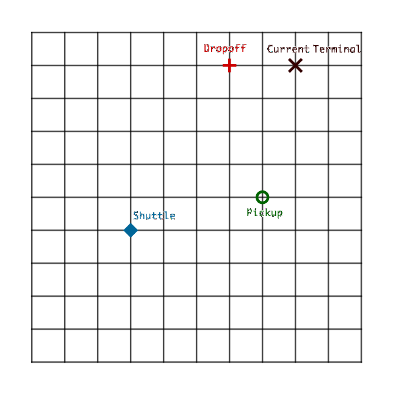

# Simple Model of On-demand Shuttle

The purpose of this project is not to solve the whole problem but to explore the fun dynamics of such a problem.

## The Grid Model

We use a shuttle on grid model.

1. The city is represented by the whole grid.
2. Shuttles running with constant speed on the grid.
3. Pickup and dropoff are instantaneous.
4. Time is simplified into steps. At each step, the shuttle has to move on unit grid.
5. The passengers are randomly requesting the pickup and dropoff locations at every d step.
6. Every request has to be fullfilled. No passenger is left behind.

## Agents

The shuttles are treated as agents.

## Steps

At each step, we evaluate the shuttle that proves to have lowest cost to pickup and dropoff the passenger.

There are many different algorithms for the cost.

1. We could recalculate the shortest route that goes through all the pickup and dropoff locations.
2. We could simply go though the pickup and dropoff locations sequentially without any optimizations.
3. We could place some restrictions on method 1 such as adding the pickup to dropoff time/distance of the passengers as another cost/punishment.